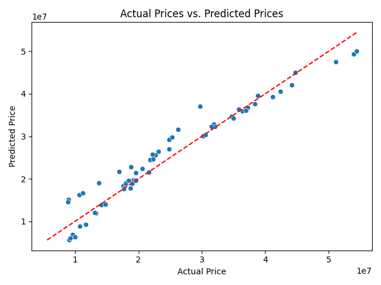
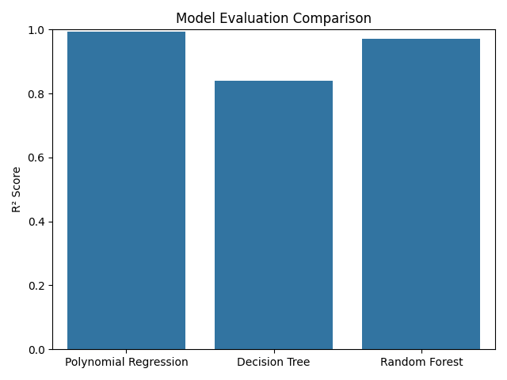
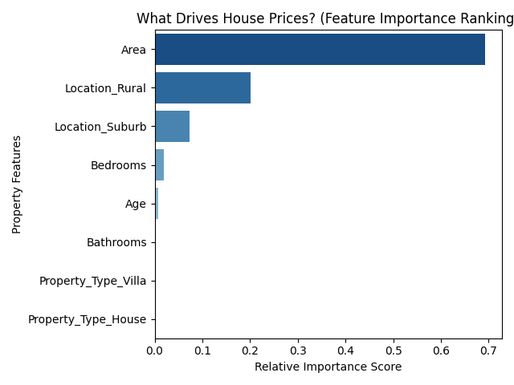

# Real Estate Price Prediction: Model Evaluation Report

## 1. Project Overview
The objective of this project was to build a machine learning pipeline capable of predicting house prices based on physical and geographical features: property area, number of bedrooms/bathrooms, property age, location, and property type.

---

## 2. Exploratory Data Analysis (EDA) Insights
Before building the models, an initial data audit was performed on `house_prices.csv`:
* **Data Integrity:** Checked for missing values and confirmed the dataset has **0 null values**, meaning no data imputation was required.
* **Key Observations:** * A clear linear relationship was observed between `Area` and `Price`.
  * Properties located in the **City Center** commanded a distinct pricing premium compared to suburban and rural properties.

---

## 3. Model Performance & Evaluation
We split the data into an 80% training set to train the models and a 20% testing set to evaluate them. We tested a baseline **Linear Regression** model and compared it against three optimization methods. 

### Performance Metrics Summary

| Model Type | Mean Absolute Error (MAE) | R² Score (%) |
| :--- | :--- | :--- |
| Baseline Linear Regression | [Insert Baseline MAE] | [Insert Baseline R2 %] |
| Polynomial Regression (Deg 2) | [Insert Poly MAE] | [Insert Poly R2 %] |
| Decision Tree Regressor | [Insert DT MAE] | [Insert DT R2 %] |
| Random Forest Regressor | [Insert RF MAE] | [Insert RF R2 %] |

### Key Takeaway:
The **[Insert your best model name, e.g., Random Forest]** achieved the highest accuracy with an $R^2$ score of **[Insert Best R2]%**, making it our champion model for production.

---

## 4. Feature Importance & Business Insights
By analyzing the internal decision mechanics of our champion model, we extracted the key variables that actually drive property values:

1. **[Top Feature, e.g., Area] ([Insert %] impact):** The absolute primary driver of valuation. 
2. **[Second Feature, e.g., Location_City Center] ([Insert %] impact):** Location acts as the strongest contextual modifier on price.

### Business Recommendations:
* **Target High-Impact Variables:** Valuation models should prioritize precise square footage tracking, as it holds the highest predictive weight.
* **Strategic Expansion:** Real estate investment strategies should heavily weight regional zoning classifications (such as City Center boundaries) over minor feature additions like a standalone extra bathroom.

---

## 5. Visual Artifacts
*(The following plots were exported automatically during code execution and confirm our performance metrics)*

### Actual vs. Predicted Prices
This plot shows how close our model's pricing guesses were to the actual market prices. The closer the points are to the red diagonal line, the better our model performed.

### Model Comparison
This bar chart visualizes the $R^2$ accuracy score jump across our different model improvement experiments.

### Final Feature Importance Ranking
This ranking clearly shows which structural elements hold the most power when predicting property values.

